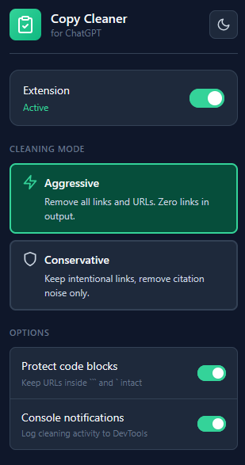
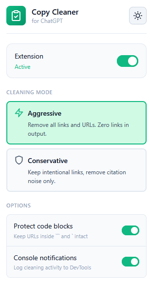

# ChatGPT Copy Cleaner


A browser extension that automatically removes citation links, reference markers, and tracking parameters when copying text from ChatGPT.

## The Problem

When you copy text from ChatGPT, the clipboard often contains:

- Citation markers like `[1]`, `[2]`
- Reference links like `([MDN Web Docs][1])`
- Reference definitions: `[1]: https://example.com "Title"`
- Tracking parameters: `?utm_source=chatgpt.com`
- Source badges: `MDN Web Docs+1`

This clutters your pastes and wastes context when feeding text back into other tools.

## The Solution

This extension intercepts copy actions and automatically cleans the text before it reaches your clipboard.

**Before:**
```markdown
Firefox extensions (also called **add-ons**) are small pieces of software you **install into Firefox** to **add features or change how the browser behaves**—kind of like "apps for your browser." They can do things like block ads/trackers, manage passwords, change how pages look, add shortcuts/tools, or integrate services you use. ([Firefox][1])

A few useful details:

* **Where you get them:** Mozilla's official catalog is **addons.mozilla.org (AMO)**. ([Mozilla Add-ons][2])
* **How they're made (high level):** Most modern Firefox extensions use the **WebExtensions** system (HTML/CSS/JS + browser APIs), which is largely compatible with Chrome-style extensions. ([MDN Web Docs][3])
* **Safety note:** Extensions can request permissions that affect privacy/security, so it's smart to install only what you need and periodically review/remove ones you don't trust. ([Mozilla Support][4])

If you tell me what you want Firefox to do (ad-blocking, password management, tab control, etc.), I can suggest a few reputable extensions.

[1]: https://www.firefox.com/en-US/features/add-ons/?utm_source=chatgpt.com "Firefox add-ons and browser extensions"
[2]: https://addons.mozilla.org/en-US/about?utm_source=chatgpt.com "About Firefox Add-ons - Mozilla"
[3]: https://developer.mozilla.org/en-US/docs/Mozilla/Add-ons/WebExtensions?utm_source=chatgpt.com "Browser extensions - Mozilla - MDN Web Docs"
[4]: https://support.mozilla.org/en-US/kb/review-installed-extensions?utm_source=chatgpt.com "Review installed extensions | Firefox Help - Mozilla Support"
```

**After:**
```markdown
Firefox extensions (also called **add-ons**) are small pieces of software you **install into Firefox** to **add features or change how the browser behaves**—kind of like "apps for your browser." They can do things like block ads/trackers, manage passwords, change how pages look, add shortcuts/tools, or integrate services you use.

A few useful details:

* **Where you get them:** Mozilla's official catalog is **addons.mozilla.org (AMO)**.
* **How they're made (high level):** Most modern Firefox extensions use the **WebExtensions** system (HTML/CSS/JS + browser APIs), which is largely compatible with Chrome-style extensions.
* **Safety note:** Extensions can request permissions that affect privacy/security, so it's smart to install only what you need and periodically review/remove ones you don't trust.

If you tell me what you want Firefox to do (ad-blocking, password management, tab control, etc.), I can suggest a few reputable extensions.
```

**Result:** All citation markers `[1]`, reference links `([Firefox][1])`, reference definitions, and tracking URLs removed. **32% shorter**, 100% cleaner.

## Screenshots

<div align="center">
  
  
  <p><em>Extension popup with settings and active status</em></p>
</div>

## Features

- **Aggressive cleaning**: Removes ALL links, URLs, citations, and reference markers
- **Conservative mode**: Keeps intentional inline links, removes citation noise only
- **Works with both copy methods:**
  - Ctrl/Cmd+C (keyboard selection)
  - ChatGPT's copy button (click interception + clipboard API hook)
- **DOM-resilient detection**: Uses `composedPath()` to find copy buttons even when ChatGPT changes its UI structure
- **Smart code block handling**:
  - Preserves URLs inside ``` and ` code blocks in message text
  - Passes through code block copy buttons unchanged (no cleaning)
- **Multi-line reference handling**: Strips wrapped reference definitions that span multiple lines
- **Console notifications**: Optional logging to DevTools
- **Cross-browser support**: Firefox and Chromium-based browsers
- **Toast notifications**: Visual feedback when cleaning is active
- **No tracking**: No analytics, no data collection

## Installation

### Chrome / Edge / Brave

1. Download or clone this repository
2. Open `chrome://extensions` (or `edge://extensions`)
3. Enable "Developer mode"
4. Click "Load unpacked"
5. Select the extension folder

### Firefox

1. Download or clone this repository
2. Open `about:debugging#/runtime/this-firefox`
3. Click "Load Temporary Add-on"
4. Select `manifest.json`

## Usage

1. Go to [chatgpt.com](https://chatgpt.com)
2. Copy text from an assistant message (Ctrl+C or copy button)
3. Paste anywhere - citation noise is automatically removed
4. A green toast notification confirms the hook is active

## How It Works

The extension uses a defense-in-depth strategy with three interception layers:

| Layer | Method | Runs In | Handles |
|-------|--------|---------|---------|
| 1 | Selection copy (`copy` event) | Content script | Ctrl/Cmd+C |
| 2 | Click interception (`composedPath()`) | Content script | Copy buttons |
| 3 | Clipboard API patch | Page world | Fallback |

**Layer 1 - Selection Copy:** Listens for `copy` events and cleans text via `clipboardData.setData()`.

**Layer 2 - Click Interception:** Uses `event.composedPath()` to detect copy button clicks regardless of DOM structure changes (shadow DOM, portals, `<div role="button">`, etc.). This is the most reliable layer for Firefox.

**Layer 3 - Clipboard Patch:** Patches `navigator.clipboard.writeText()` and `clipboard.write()` in the page context as a fallback. A bypass marker prevents double-cleaning when Layer 2 succeeds.

**Smart Content Detection:**
- Detects if a copy button is for a code block vs. entire message
- Code block copies are passed through unchanged
- Message copies are cleaned of citations and reference noise

**Multi-line Reference Handling:**
- Handles wrapped/split reference definitions that span multiple lines
- Uses a line-scanner to strip trailing reference blocks from the bottom up

## Files

```
├── manifest.json       # Extension manifest (MV3)
├── background.js       # Background script (handles page-world injection)
├── content.js          # Content script (Layer 1: selection copy, Layer 2: click interception)
├── page_final.js       # Page-world script (Layer 3: clipboard API patches)
├── popup.html/css/js   # Settings popup UI
├── icons/              # Extension icons
└── generate-icons.html # Icon generator tool
```

## Browser Support

- Chrome 88+
- Edge 88+
- Firefox 109+
- Brave, Opera, Vivaldi (Chromium-based)

## Privacy

**This extension respects your privacy:**

- ✅ **No data collection** - Zero analytics, telemetry, or tracking
- ✅ **No network requests** - Extension never connects to external servers
- ✅ **No data transmission** - All processing happens locally in your browser
- ✅ **Minimal permissions** - Only requests `storage` (for settings) and `scripting` (for injection)
- ✅ **Open source** - Full source code available for audit

**What gets stored:**
- Your settings only (cleaning mode, theme, toggle states)
- Stored locally in your browser
- Never sent anywhere

**What we DON'T see:**
- The text you copy
- Your ChatGPT conversations
- Your browsing history
- Anything else

For more details, see [SECURITY.md](SECURITY.md).

## Security

This extension is built with security in mind:

- No external dependencies
- No dynamic code execution (no `eval()`)
- No third-party scripts or CDNs
- Content Security Policy compliant
- Open source and auditable

**Found a security issue?** Please report it privately to **code@adptly.com**. See [SECURITY.md](SECURITY.md) for details.

## Troubleshooting

**Copy button not working?**
- Check browser console for `[ChatGPT Copy Cleaner]` messages
- If you see "hook blocked", CSP may be preventing script injection
- Selection copy (Ctrl+C) should still work as fallback

**Toast not appearing?**
- Make sure you're on chatgpt.com or chat.openai.com
- Reload the page after installing the extension

For more help, see [SUPPORT.md](SUPPORT.md).

## Contributing

Contributions are welcome! We appreciate bug reports, feature requests, and pull requests.

Before contributing, please:
- Read our [Contributing Guidelines](CONTRIBUTING.md)
- Follow our [Code of Conduct](code_of_conduct.md)
- Check existing issues to avoid duplicates

## Changelog

See [CHANGELOG.md](CHANGELOG.md) for a detailed history of changes.

## License

MIT License - see [LICENSE](LICENSE) file for details.

## Support

- Report bugs or request features via [GitHub Issues](https://github.com/adptly/chatgpt-copy-cleaner/issues)
- For questions, email code@adptly.com or open a discussion on the repository

---

Made with care for the community. If this extension helps you, consider starring the repository!
